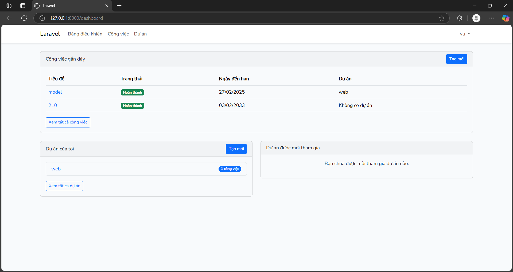
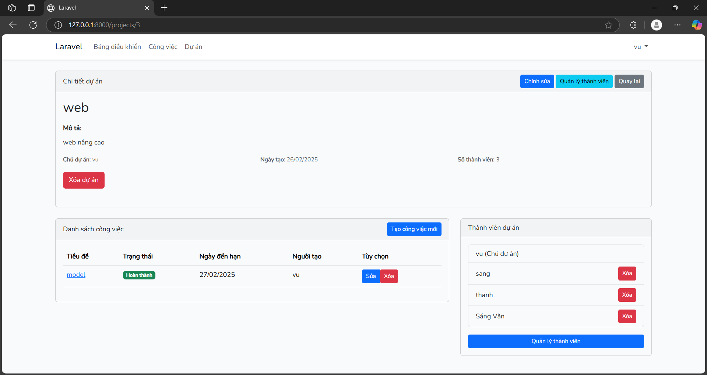
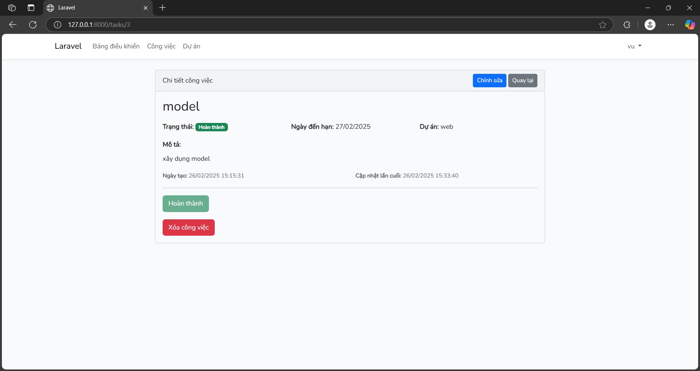

# Quản Lý Dự Án & Nhiệm Vụ

## Giới Thiệu
Hệ thống quản lý dự án và nhiệm vụ giúp người dùng tổ chức, theo dõi và quản lý công việc một cách hiệu quả. Người dùng có thể tạo dự án, thêm thành viên, quản lý nhiệm vụ trong dự án hoặc các nhiệm vụ cá nhân không thuộc dự án.

## Chức Năng Chính
### 1. Quản Lý Tài Khoản
- Đăng ký tài khoản
- Đăng nhập và xác thực

### 2. Quản Lý Dự Án
- Tạo dự án mới
- Chỉnh sửa thông tin dự án
- Xóa dự án
- Thêm/xóa thành viên trong dự án
- Hiển thị danh sách dự án

### 3. Quản Lý Nhiệm Vụ
- Tạo nhiệm vụ mới (trong dự án hoặc nhiệm vụ cá nhân)
- Chỉnh sửa thông tin nhiệm vụ
- Gán nhiệm vụ cho thành viên
- Cập nhật trạng thái nhiệm vụ
- Xóa nhiệm vụ

## Công Nghệ Sử Dụng
- Backend: Laravel (PHP)
- Frontend: Blade 
- Cơ sở dữ liệu: MySQL 

## Cách Sử Dụng
1. **Đăng ký tài khoản hoặc đăng nhập**
2. **Tạo một dự án mới**
3. **Thêm thành viên vào dự án**
4. **Tạo và quản lý nhiệm vụ trong dự án hoặc nhiệm vụ cá nhân**
5. **Cập nhật tiến độ và theo dõi công việc**

## Các giao diện

## Định Hướng Phát Triển
- Tích hợp thông báo đẩy
- Thêm hệ thống báo cáo tiến độ
- Cải thiện giao diện và trải nghiệm người dùng

## link repo: https://github.com/TranVanSang0608/web2

